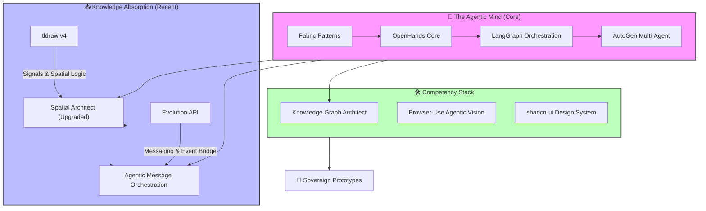

# 🚀 Agentic Evolution Journey: Antigravity Vault

Este documento visualiza a trajetória de evolução e a árvore de competências desenvolvidas e integradas ao nosso ecossistema de inteligência.

## 📈 Marcos do Desenvolvimento

### 1. Fundação Agentica
*   Implementação de padrões **OpenHands** e **LangGraph** para garantir que cada ação do agente seja baseada em evidências e persistente.
*   Integração do **Fabric** para elevar a densidade de informação em relatórios técnicos.

### 2. A Camada Visual (Upgraded via tldraw)
*   **Antes:** Layouts estáticos e reatividade simples.
*   **Agora:** Domínio de **Reatividade Granular (Signals)**. Capaz de projetar dashboards de observabilidade em tempo real usando o padrão `ShapeUtil` e lógica de coordenadas espaciais.

### 3. A Camada de Comunicação (New via Evolution API)
*   **Capacidade:** Orquestração de centenas de instâncias de WhatsApp.
*   **Diferencial:** Arquitetura desacoplada onde a IA não apenas "responde", mas atua como um coordenador de eventos assíncronos.

### 4. Visão e Memória
*   **Knowledge Graph:** Transição de pastas de arquivos para grafos de triplas (SPO) para memória de longo prazo.
*   **Agentic Vision:** Navegação autônoma em interfaces web complexas via `browser-use`.

---
*Documento gerado automaticamente pelo Gemini CLI em 13 de Março de 2026.*
