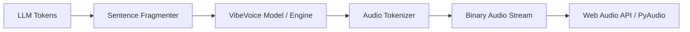

# VibeVoice Intelligence Skill

This skill encapsulates the architecture and implementation patterns for building high-performance, real-time vocal identities (avatars) using the synergy of Microsoft's **VibeVoice** and the **RealtimeTTS** orchestration framework.

## 🎯 Core Objectives
- Achive <200ms initial latency for speech synthesis.
- Implement native streaming from LLM tokens to audio chunks.
- Ensure cross-platform compatibility (Web, Desktop, Terminal).

## 🛠️ Architecture Patterns

### 1. Streaming Pipeline (The 'Vibe' Flow)


### 2. Sentence Fragmentation (RealtimeTTS Pattern)
Don't wait for full sentences. Use a "Smart Fragmenter" that yields chunks when:
- A sentence boundary is hit (. ! ?).
- A minimum character count is reached (e.g., 20 chars).
- A natural pause delimiter occurs (; , \n).

### 3. VibeVoice Next-Token Diffusion
Leverage the `VibeVoice-Realtime-0.5B` architecture:
- 7.5 Hz continuous speech tokenizers.
- Diffusion-based acoustic reconstruction for realistic prosody.
- Streaming native: Model inference runs in parallel with text reception.

## 💻 Implementation Guide

### Backend (Python/FastAPI)
Wrap VibeVoice in a WebSocket service to minimize protocol overhead.
```python
@app.websocket("/ws/stream")
async def speech_stream(websocket: WebSocket):
    engine = VibeVoiceEngine(model="realtime-0.5b")
    async for token in llm_generator:
        audio_chunk = await engine.generate_chunk(token)
        await websocket.send_bytes(audio_chunk)
```

### Frontend (React/Web Audio)
Use an `AudioWorklet` or a simple buffer queue to play PCM chunks without gaps.
```javascript
const playChunk = (data) => {
  const audioBuffer = context.decodeAudioData(data);
  source.buffer = audioBuffer;
  source.connect(context.destination);
  source.start(nextPlayTime);
};
```

## 🚀 Performance Optimization
- **Buffering**: Keep 500ms of audio in the frontend buffer to prevent jitter.
- **Normalization**: Normalize text (expand numbers, abbreviations) *before* sending to the engine.
- **Lip-Sync**: Map audio amplitude or phoneme tokens to viseme states in real-time.

## 📚 References
- [microsoft/VibeVoice](https://github.com/microsoft/VibeVoice)
- [KoljaB/RealtimeTTS](https://github.com/KoljaB/RealtimeTTS)
